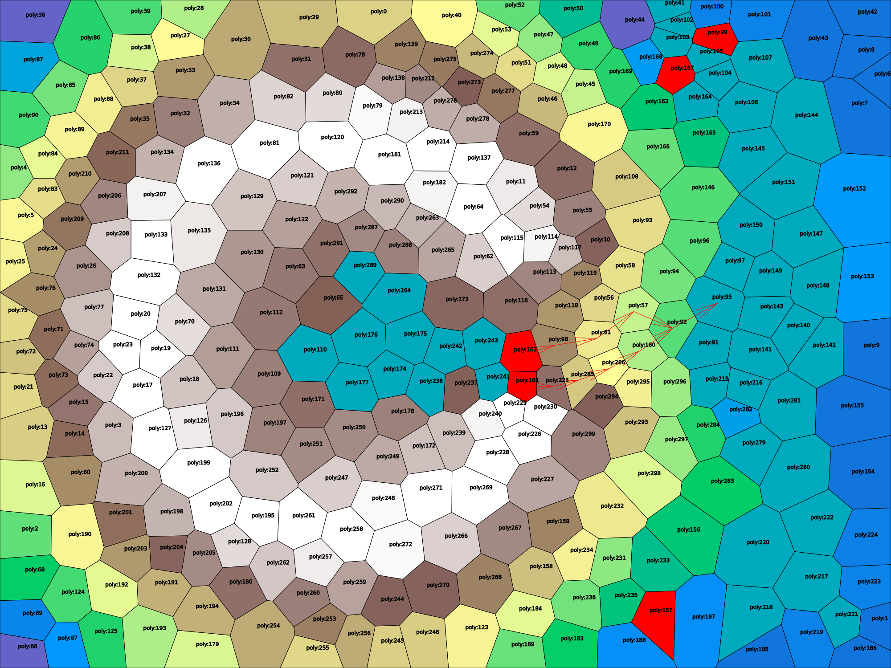
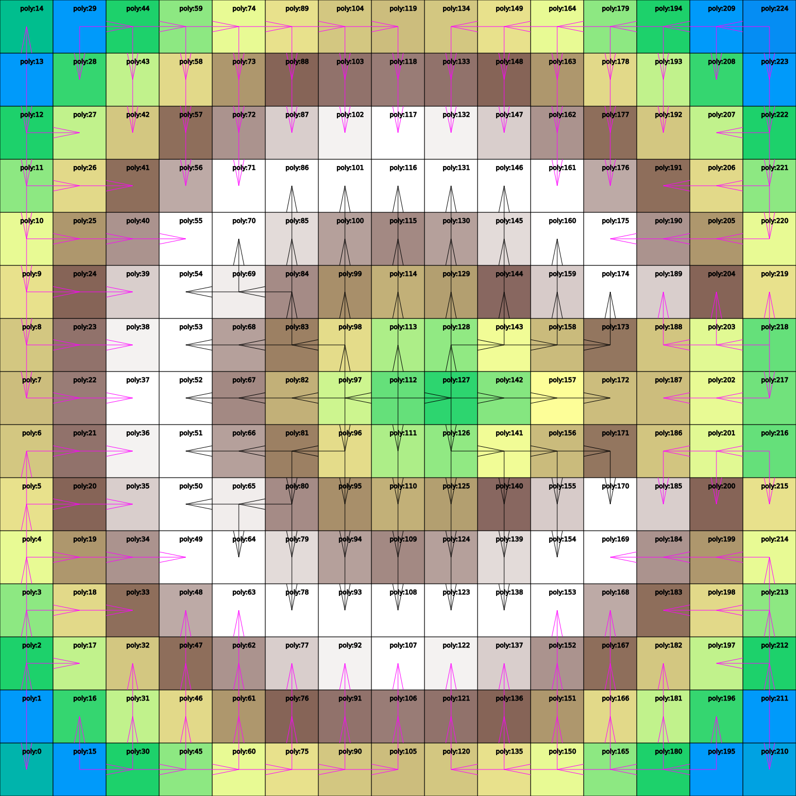
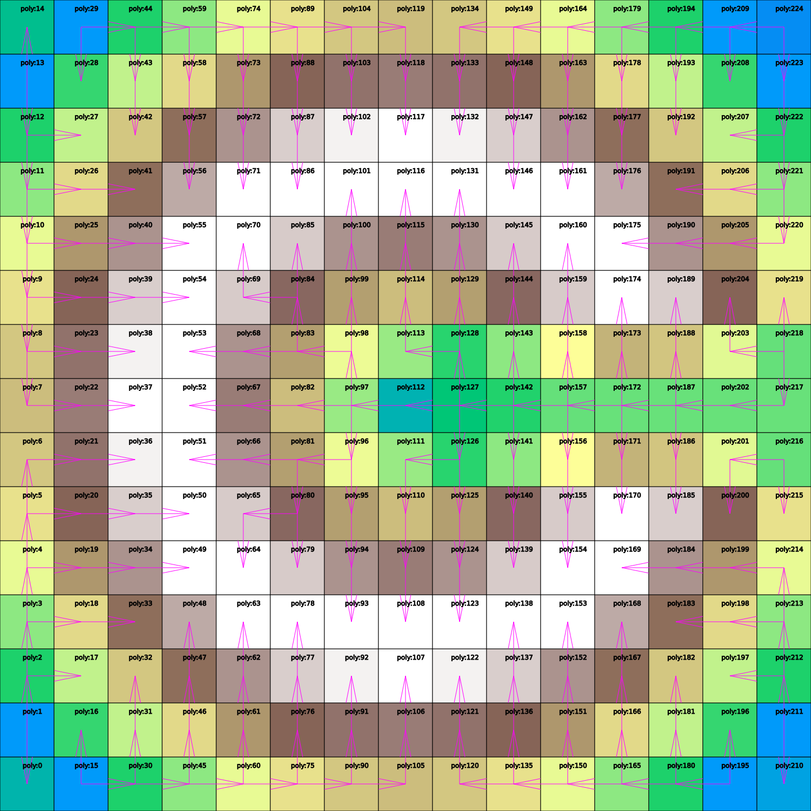

# simple_rivers

install
```
pip install requirements.txt
pip -m build 
```
then in `dist` install the procuded wheel


So. Procedural landscapes are cool.

There is just the small problems of how to create rivers.

Here are some links:

http://www-cs-students.stanford.edu/~amitp/game-programming/polygon-map-generation

https://frozenfractal.com/blog/2024/3/25/around-the-world-13-zooming-in/

Then there is this very cool but unfortunately incompatible one.

https://github.com/weigert/SimpleHydrology

and the coding adventure by sebastian lague of course

This project calculates the gradient descent paths and erodes terrain to the point where all cells drain to some edge on the map.

The actual rivers are then generated from the number of contributes areas  or the rain that falls on them.

This is from my project that uses this code:


These are the start and end states for getting the gradients and erosion.



This code does not come with a plotting library, so you have to figure out what to use, but I think plotting libraries are not tha common in python anyway, so the chance that my format would fit what you need is slim.

That's why the output data format is just a dictionary with roughly this format:
```
d = { index : { 
        "center":(x,y,z), 
        "elevation":0,
        }
    }
```

Matplotlib has a colormap function I used for plotting but it's not a requirement for the code.
